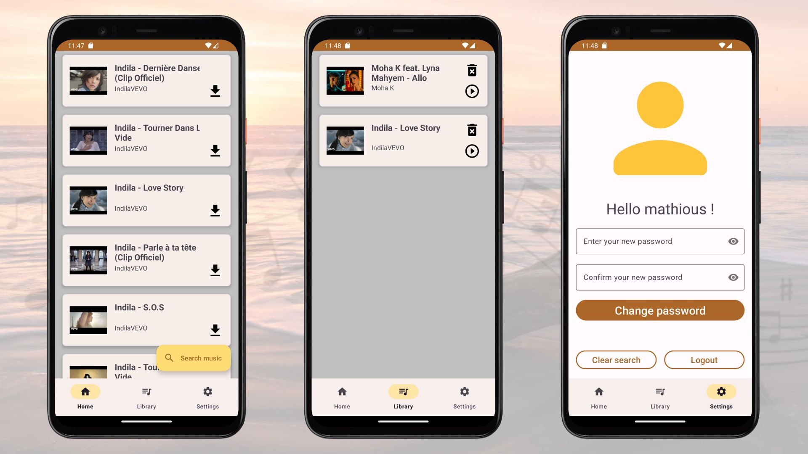

Mobile Devices Project : Taga-Taga App
======================================

# Description of the app

## Purpose of the application:

Convert youtube videos to audios

## Main features:

- [x]  Account creation
- [x]  Login to your account
- [x]  Search for youtube videos
- [x]  Download/convert youtube videos to audios
- [x]  Addition to audio library
- [x]  Deleting from audio library

## Structure of the project

```
VideoConverterLSM/app/src/main/java/com/mobiledevices/videoconverter
.
├── core
│   ├── dao
│   │   └── FirestoreRepository.kt
│   ├── service
│   │   └── MusicService.kt
│   ├── utils
│   │   ├── PasswordUtils.kt
│   │   ├── SessionManager.kt
│   │   └── UserManager.kt
│   └── validation
│       └── Validator.kt
├── model
│   ├── Music.kt
│   └── User.kt
├── ui
│   ├── adapter
│   │   ├── MusicHomeAdapter.kt
│   │   └── MusicLibraryAdapter.kt
│   ├── application
│   │   ├── ApplicationActivity.kt
│   │   ├── HomeFragment.kt
│   │   ├── LibraryFragment.kt
│   │   └── SettingsFragment.kt
│   └── connection
│       ├── ConnectionActivity.kt
│       ├── LoginFragment.kt
│       ├── SignupFragment.kt
│       └── WelcomeFragment.kt
└── viewModel
    ├── LoginViewModel.kt
    ├── MusicViewModel.kt
    ├── SettingsViewModel.kt
    ├── SharedViewModel.kt
    └── SignupViewModel.kt
```

In the Core, we find:

- the DAO branch with the database, created on Firestore, which allows it to be stored directly on
  the Cloud
- the Service branch which allows you to retrieve Youtube search results
- the Utils branch to hash the password and manage connection/disconnection
- the Validation branch to check usernames and passwords when login in

In the Model, we find:
the initializing the two tables: Music and User

In the UI, we find:

- the Adapter branch to manage interactions and displays for the RecyclerView in the Home and
  Library fragment
- the Application branch to manage the activity of the application once connected and the various
  associated fragments (home, library, settings)
- the Connection branch to manage the activity of the application in the connection part and the
  different associated fragments (welcome, login, signup)

In the ViewModel, we find:
the entire front end part for the different pages of the application (login, signup, music,
settings, library)

## Description of the features



When the user open the app, he is directly on the Welcome Page, on which he can choose to Login or
to Signup.

On the Signup Page, he has to fill different data such as his username, email, password and a
confimartion of his password.

On the Login Page, he can directly connect with his username and password, that must have been
chosen previously.


Once the user is connected inside the app, he is directed to the Home Page.
He can use the "search music" button, on which he can type his research. The 6 first results from
Youtube will be displayed on the page.
Then, he can download the videos he wants.

All these videos will be added on the Library page, which gathers all the downloads videos,
converted to audio.
On this same page, the user has the possibility to delete the audio, by clicking on the bin icon.
That is also where there is the button to listen to the song.

The last page is the Setting Page, in which the user can change his password, clear his search and
logout of his account.

## Used technologies

- Front-End: Kotlin
- Back-End: Kotlin, Python, Firestore, SQL

# Project Management

## How we worked ?

We worked in a team of three people.
We used Github to share the progress of our project.
We separated front-end developpement and back-end developpement for the basic actions at first and
then, we gathered them.
After that, we implemented few improvements.

# Installation

## Prerequisites

- Gradle
- Android Studio with its SDK
- Python 11

## Utilisation

To launch the app in Android Studio, we need the prerequisites above.
It is not possible yet to install it on Android devices.

## Tests Unitaires

We implemented unit tests to test the different functionnalities separately.
To launch them, we just have to go to the test class and run it:
app/src/test/java/com/mobiledevices/videoconverter/ExampleUnitTest.kt
app/src/test/java/com/mobiledevices/videoconverter/MusicTest.kt
app/src/test/java/com/mobiledevices/videoconverter/UserTest.kt

## Known Issues/Limitations

We're facing an SSL certificate issue with an emulator in our mobile app, which is intended for
downloading YouTube videos as audio. This problem involves a conflict between PyTube, a Python
library we use for downloading YouTube videos, and the emulator.

## Future improvements

The main improvement we want to make is to be able to download the audio from youtube on the device
directly.
Indeed, in the current version of the app, the audio is playing on the youtube app from the library.

# Conclusion

This application aims to be used on Android devices.

# Contacts / Authors

- [Mathis ESTEVE]
- [Shaina BAKILI MUMBUKU]
- [Lucie GALLOIS]
